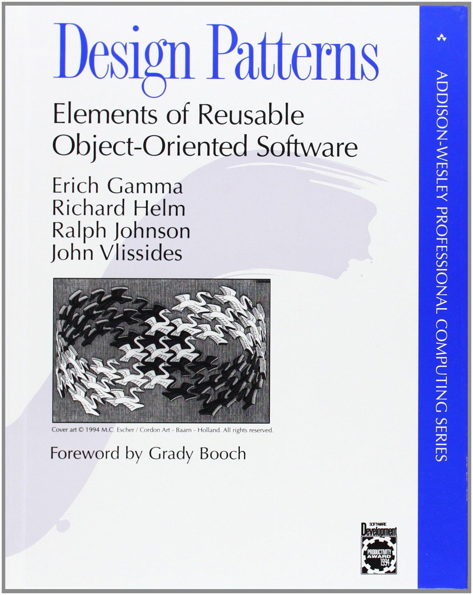
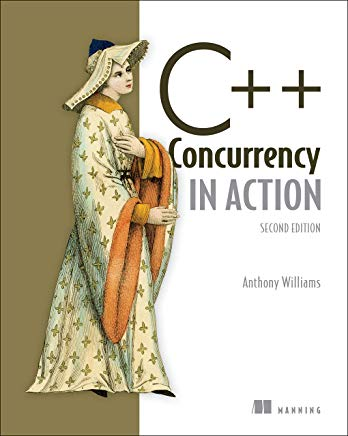

# Arquitectura del Software I
<small>
Created by <i class="fab fa-telegram"></i>
[rmarku]("https://t.me/rmarku")
</small>

---
## Contenidos

* Patrones de diseño (programación)
* Programación concurrente y paralelismo
* MVC - Framekorks - Programación WEB - HTTP

---
## Patrones de diseño (programación)

Libro:

**Design patterns: elements of reusable object-oriented software** 
by Erich Gamma, Richard Helm, Ralph Johnson, John M. Vlissides

---
##  Programación concurrente - Tiempo real.

Libro: 
<b>C++ Concurrency in action</b> 
Anthony Williams

---
##  MVC - Framekorks - Programación WEB - HTTP
#### Muy practico

* Javascript - NodeJS (Sails.js, Meteor, Express)
* Python - Django
* PHP - Symphony
* U otro framework MVC

