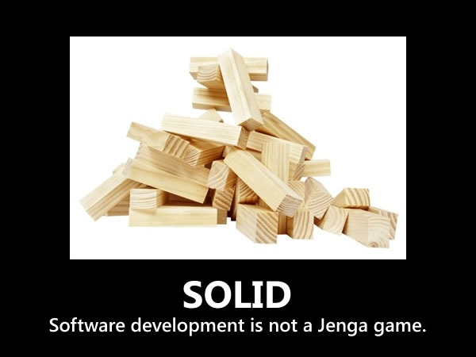

# Principios de Diseño SOLID
<small>
Created by  

[rmarku]("https://t.me/rmarku") <i class="fab fa-telegram"></i> 

</small>
---

## Principios de Diseño

Los principios de diseño son reglas que nos ayudaran a tener un diseño mantenible.

---

---
### Problemas en el código

* Código grande, miles de lineas
* Código repetido (copy paste)
* Para realizar un cambio hay que modificar muchas cosas
* Complejidad ciclomática elevada

---
### Solución:

Para solucionar estos problemas, debemos programar siguiente buenas practicas y principios.

Alguno de esos principios, son los principios SOLID

---
### Repaso de POO

* **¿Que es?:** Es un estilo de programación
* **Formada por 4 pilares**
  * Encapsulamiento
  * Herencia
  * Polimorfismo
  * Abstracción
* Se crean objetos con responsabilidades únicas que contienen campos, atributos y métodos

---
### Repaso de POO

Siempre se aconseja estas dos medidas como buenas practicas

* **Acoplamiento** se busca tener un bajo acoplamiento
* **Cohesión** se busca tener una alta cohesión

---
### Design Smells

Se dice que el código huele, cuando se presiente que nos traerá problemas mas adelante.

Algunos de ellos son:

* Rigidez
* Fragilidad
* Inmovilidad
* Viscosidad
* Complejidad innecesaria
* Repetición innecesaria
* Opacidad

---
### Principios de diseño en POO

* **DRY**  dont repeat yourself
* **KISS** Keep it simple stupid
* **YAGNI** You are going to need it

---
### Principios de diseño en POO

#### SOLID

* Conjunto de principios, no son reglas.
* No es un framework, ni una tecnología o librería ni metodología.
* Su propósito es generar código fácil de entender y mantener.
* Representa cinco principios básicos de la POO

---
## SOLID

* **S**ingle responsability
* **O**pen closed
* **L**iskov Substitution
* **I**nterface segregation
* **D**ependency Inversion