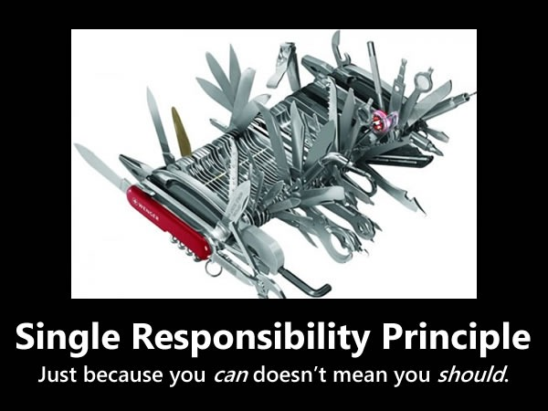

# Principios de Diseño SOLID

## Principio de Responsabilidad Simple
<small>
Created by  

[rmarku]("https://t.me/rmarku") <i class="fab fa-telegram"></i> 

</small>
---

### Principio de Responsabilidad Simple

_"A class should have one, and only one, reason to change"_

Robert C. Martin

---

---
### Principio de Responsabilidad Simple

* Cada clase debe tener una única responsabilidad
* Una clase debe tener una, y solo una, razón de cambio.
---
### Principio de Responsabilidad Simple

#### ¿Sobre qué  artefactos aplica este principio?

* Métodos
* Clases
* Bibliotecas
* Módulos
* Sistemas

---
### Principio de Responsabilidad Simple

#### ¿Cuándo debemos aplicar este principio?

* Cuando una clase es muy larga (300+ lineas)
* Cuando un método es muy largo (40+ lineas)
* Cuando existen muchas dependencias a otros objetos (20+)
* Cuando hay baja cohesión
* Cuando se usan nombres muy genéricos: Útil, Manager, Process
* Cuando hay uso del antipatron Spagethi Code.

---
### Principio de Responsabilidad Simple

#### Argumentos en contra

* Demasiadas Clases
* Complicado de entender el panorama general del diseño

<small>**NOTA**: Tener más clases no significa necesariamente que el código sea mas complicado, hay casos y casos.</small>
---

# Demo