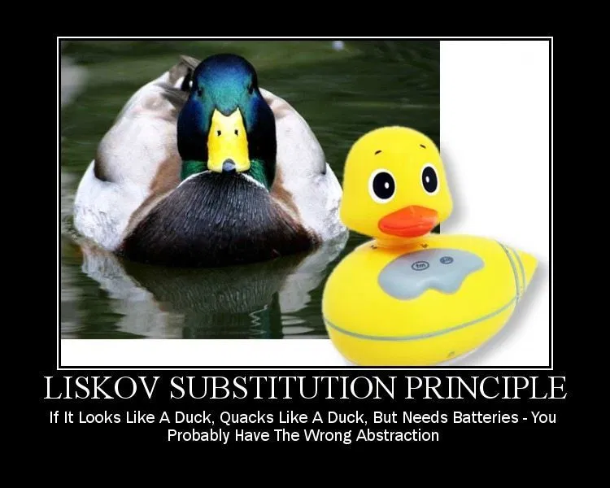

# Principios de Diseño SOLID

## Principio de Sustitución de Liskov
<small>
Created by  

[rmarku]("https://t.me/rmarku") <i class="fab fa-telegram"></i> 

</small>
---

### Principio de Sustitución de Liskov

_"Subtype Requirement: Let ϕ(x) be a property provable about objects x of type T. Then ϕ(y) should be true for objects y of type S where S is a subtype of T. "_

Barbara Liskov 

---

---
### Principio de Sustitución de Liskov

* Una clase derivada puede ser reemplazada por cualquier otra que use su clase base sin alterar su correcto funcionamiento.

* Polimorfismo
---
### Principio de Sustitución de Liskov

#### ¿Sobre qué artefactos aplica este principio?

* Clases

#### ¿Qué beneficios trae el trabajar con este principio?

* Flexibilidad
* Mantenimiento, sistemas fáciles de cambiar y evolucionar.

---
### Principio de Sustitución de Liskov

#### ¿Cuándo debemos aplicar este principio?

* Cuando se quiere extender el funcionamiento usando clases derivadas sin tocar el código base.
* Cuando existan clases que compartan el mismo comportamiento.
* Cuando aplicamos el principio Open Closed.

---

# Demo