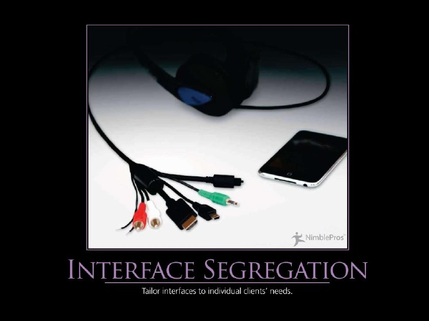

# Principios de Diseño SOLID

## Principio de segregación de la interfaz
<small>
Created by  

[rmarku]("https://t.me/rmarku") <i class="fab fa-telegram"></i> 

</small>
---

### Principio de segregación de la interfaz

_"no client should be forced to depend on methods it does not use"_

---

---
### Principio de segregación de la interfaz

* Un cliente no debe ser forzado a implementar interfaces que no necesite.
* Define interfaces pequeñas que resuelvan un problema especifico (Role Interface)
  en lugar de tener interfaces grandes que hagan muchas cosas (Head Interface)
---
### Principio de segregación de la interfaz

#### ¿Sobre qué artefactos aplica este principio?

* Clases
* Interfaces

#### ¿Qué beneficios trae el trabajar con este principio?

* Bajo acoplamiento
* Alta cohesión
* Código fácil de cambiar y mantener

---
### Principio de segregación de la interfaz

#### ¿Cuándo debemos aplicar este principio?

* Cuando existan clases con métodos vacíos o que devuelvan valores por defecto
* Cuando existan clases con métodos que devuelvan excepciones tipo NotImplemented
* Cuando un cliente usa solo algunos métodos de una clase.

---

# Demo