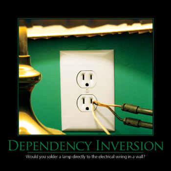

# Principios de Diseño SOLID

## Principio de Inversión de Dependencia
<small>
Created by  

[rmarku]("https://t.me/rmarku") <i class="fab fa-telegram"></i> 

</small>
---

### Principio de Inversión de Dependencia

_"High-level modules should not depend on low-level modules. Both should depend on abstractions"_

---

---
### Principio de Inversión de Dependencia

* Los módulos de alto nivel no deben depender de los módulos
de bajo nivel, ambos deben depender de abstracciones.
* Las abstracciones no deben depender de los detalles, los
detalles deben depender de las abstracciones.

---
### Principio de Inversión de Dependencia

#### ¿Sobre qué artefactos aplica este principio?

* Clases
* Módulos

#### ¿Qué beneficios trae el trabajar con este principio?

* Bajo acoplamiento
* Testeabilidad.
* Flexibilidad

---
### Principio de Inversión de Dependencia

#### ¿Cuándo debemos aplicar este principio?

* Cuando hace falta desacoplar piezas de software que pueden
cambiar en el futuro.
* Cuando el nivel de acoplamiento en el código es algo.

---
### Principio de Inversión de Dependencia

#### Argumentos en contra de este principio

* Requiere mayor experiencia
* Requiere más esfuerzo el diseñar los artefactos
* Demasiadas interfaces
* Complicado entender el panorama general del diseño

---

# Demo