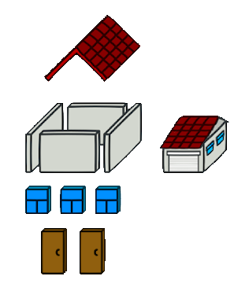

# Patrones de diseño

## Patron Builder

<small>
Created by <br/>

[rmarku]("https://t.me/rmarku") <i class="fab fa-telegram"></i> 

</small>
---
### Patron Builder

Este patron **Creacional** permite construir objetos complejos paso a paso. Permite crear diferentes
representaciones del objeto usando el mismo código para construirlo.

---
### Patron Builder

#### Motivación

Cuando un objeto es muy complejo, requiere muchos datos para inicializarse o  esta construido por
muchos otros objetos, surgen problemas al tratar de instanciarlos.

```cpp
class Casa{
    Casa(bool Puerta, int ventanas, bool garage, bool pileta, int arboles,
         int arbustos, int pisos, int habitaciones, int banios, bool comedor,
         bool living, techo tipo_techo, int escalera);
}

...
Casa *miCasa = new Casa( true, 1, false, false, 1, 0, 2, 2, 2, 0, 0 ,PLANO, 1);

```
---
### Patron Builder
```cpp
class Casa{
    Casa();
    addPuerta(Puerta p);
    addVentana(Ventana v);
    addGarage(Garage g);
    addPileta(Pileta p);
    add.....
}
...
Casa *miCasa = new Casa();
miCasa.addPuerta(new Puerta());
miCasa.addVentana(new Ventana());
miCasa.addGarage(new Garage());
miCasa.addPileta(new Pileta());
miCasa.add......

```
---
### Patron Builder

#### Intención:

Separar la construcción de objetos complejos de su representación.



---
#### Aplicabilidad:

Se debe usar Builder cuando:

* El algoritmo para crear un objeto complejo debe ser independiente del objeto y de como se construye.
* El proceso de construcción debe permitir diferentes representaciones del objeto.

---
#### Patron Builder

#### Estructura


---
### Patron Builder

#### Participantes

Se compone de dos elementos principales

* **DIRECTOR**: Quien se encarga de ejecutar cada proceso de instanciamiento.
* **BUILDER**: La interfaz abstracta que que crea partes del producto
* **CONCRETE BUILDER**: Implementa la interfaz Builder y save construir el producto concreto

---

#### DEMO

#### Estructura


---
# DEMO
