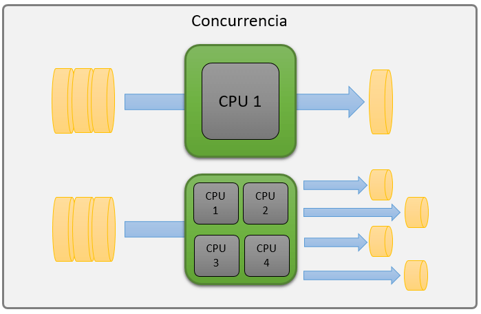
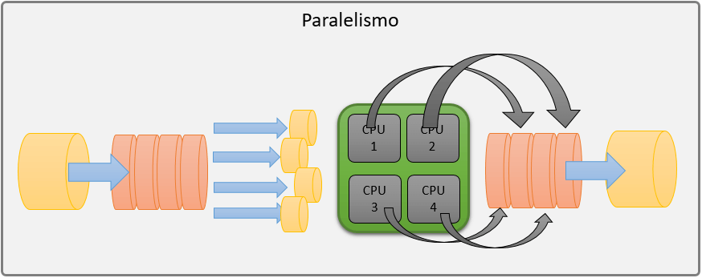
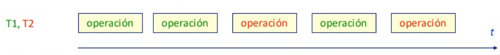
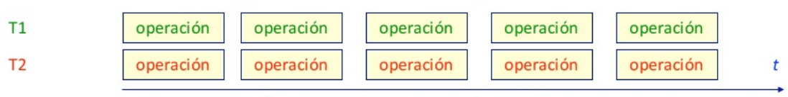
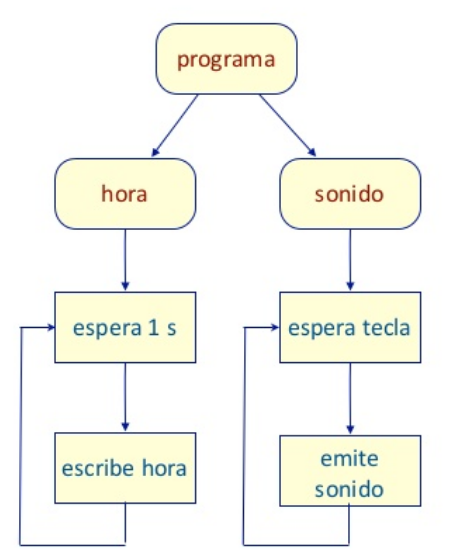
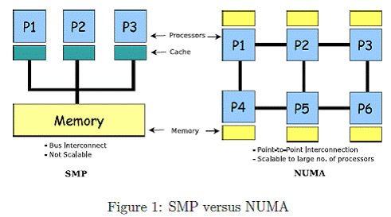

# Paralelismo y Concurrencia

---
## Concurrencia

Se refiere a la habilidad de distintas partes del programa de ser ejecutados en desorden.



---
## Paralelism

Es la capacidad de realizar varios calculos simultáneamente basado en el principio de divide y triunfaras.



---
## ¿Cómo funciona?
En un sistema monoprocesador se intercalan las operaciones de las tareas (multiplexado en el tiempo, paralelismo lógico) 


---
## ¿Cómo funciona?
En un sistema con varios procesadores se puede ejecutar cada tarea en un procesador (ejecución simultanea,paralelismo físico) 


---
## Concurrencia vs. Paralelismo

* La concurrencia es mas general que el paralelismo
* Las soluciones en P. Concurrente son validas en paralelismo
* Paralelismo es ejecución simultanea de procesos concurrentes

---
## Aplicaciones

* Interfaces de usuario reactivas
    * atención a sucesos asíncronos
    * gestión de ventanas
* Servidores
    * atención a múltiples clientes
    * gestión de protocolos de comunicación
* Mejoras de rendimiento
* Cálculos complejos

---
## Problema ejemplo

Hacer un programa que:

* muestre la hora cada 1s
* emita un sonido cuando aprietan la tecla enter

Problema:

* la tecla se puede pulsar en cualquier momento
* conflicto de un suceso asíncrono con uno síncrono

---
## Solución



---
## Solución

```
/* Hora */
while(1){
    sleep(1000);
    hora = Time.getTime();
    cout << "La hora es " << hora;
}
```
```
/* Sonido */
while(1){
    waitKey();
    beep(440);
}
```


---
## Propiedades de los programas concurrentes

* Corrección
* Seguridad
* Vivacidad
* Equidad
  
---
## Arquitecturas

* SMP (Symmetric multiprocessing)
* NUMA (Non-Uniform Memory Access)
* GPGPU (General Purpose GPU)


---
## Real Time o reactive computing

* Depende de lo que se espera del sistema
* Que tan rápido responde a los eventos

#### Tiempo real != Performance
