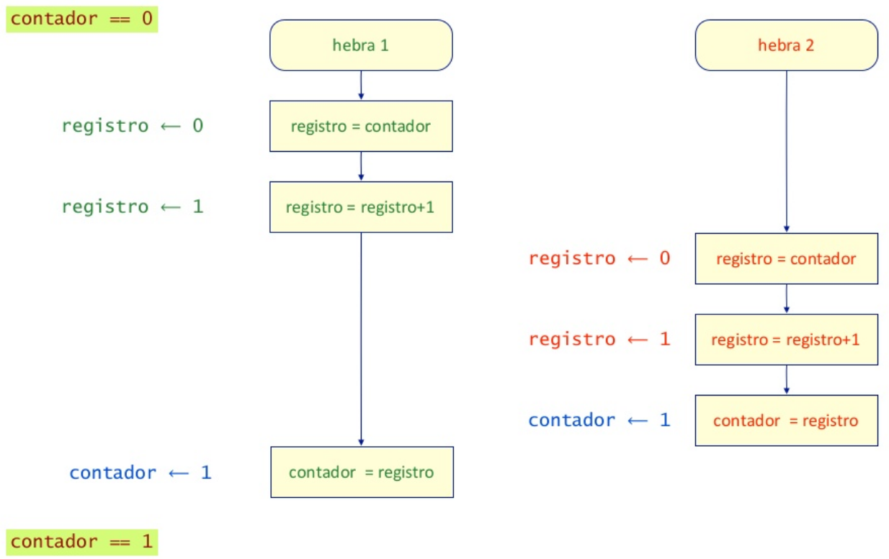
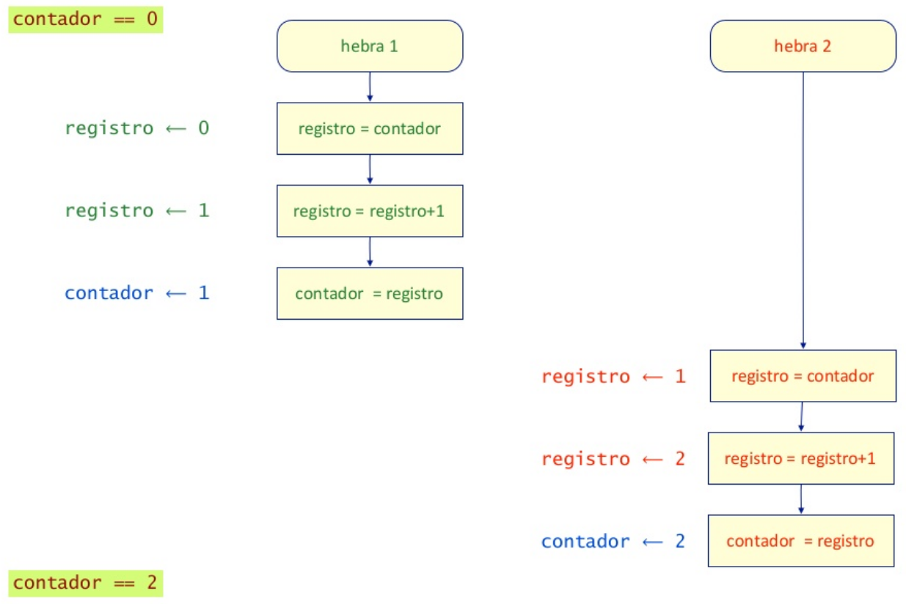
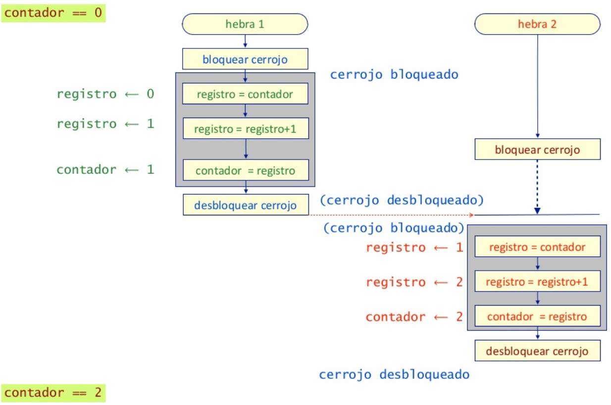
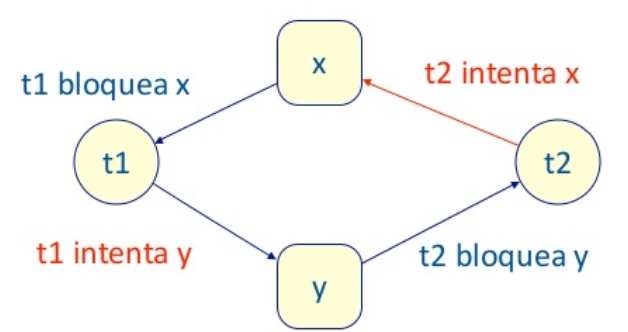

# Concurrencia

---
## Concurrencia

Las hebras de un programa pueden ser Independientes, la ejecución de una no afecta lo que hagan las demás.
...es mas común que varias hebras cooperen para realizar una función en común.
un mecanismo de cooperación son las variables compartidas 

---
## Ejemplo

 Problema de los Jardines: hay dos puertas giratorias en un jardín, una para entrar y otra para salir. Un hilo procesa cada puerta y tienen una variable en común. 

---
## Problema
Si ambos hilos utilizan la misma variable al mismo tiempo surgen problemas

Esa sección de código donde ambos procesos utilizan la misma variable, se llama Sección Crítica

Cuando el resultado depende del orden de entrada de las operaciones de c/hilo se llama Condición de Carrera

---
## Problema

---
## Problema

---
## Condición de carrera
 El resultado puede ser 1 o 2
* Cada ejecución es distinta (comportamiento indeterminado)
* Imposible de hacer ensayos o test (cada vez un resultado diferente)

---
## Region crítica y exclusión mutua

* Los segmentos de código en que se accede a variables compartidas se llaman regiones críticas
* Para evitar condiciones de carrera es preciso asegurar la exclusión mutua entre hilos en las regiones criticas 
* Cuando un hilo está en una región crítica, ningún otro hilo puedo acceder a los mismos datos
* De esta forma se consiguen que las operaciones con variables compartidas sean atómicas.

---
## Exclusión Mutua (Mutex)

 Es la forma de asegurar la exclusión mutua. 

* Puede estar en dos estados: 
   * Bloqueado (locked)
   * Desbloqueado (unlocked)
* Dos operaciones atómicas: 
  * lock
  * unlock
* el hilo que quiere bloquear, debe esperar a que esté desbloqueado
al desbloquearse, el mutex avisa que se puede continuar. 

---
## Exclusión Mutua (Mutex)

---
## Interbloqueos (deadlocks)

* Situación en la que varios hilos están suspendidos esperando unos de otros y ninguno puedo avanzar
* Se puede dar cuando se usan recursos de forma exclusiva y se asignan a distintos hilos
* Se dice que hay espera circular.
  
---
## Interbloqueos (deadlocks)

---
## Prevenir interbloqueos

* Los interbloqueos no se pueden detectar mediante pruebas sólo ocurrren de vez en cuando un programa puede pasar las pruebas y fallar mas tarde 
* Para prevenir interbloqueos, hay que evitar que se dé alguna de las condiciones necesarias
requiere disciplina por parte del programador
ponerse de acuerdo en seguir algunas reglas. 

---
## Bloqueos vivos e inanición
Se dan cuando se trata de invalidar la condición de "Tener y esperar" 
* Uno de los procesos no conseguirá nunca los recursos: inanición (starvation)
* Ninguno conseguirá los recursos: bloqueo "vivo" (livelock)

---

## Resumen

* El uso de recursos compartidos puede causar problemas difíciles de detectar
* Interbloqueo (deadlock) - problema de seguridad
* Bloqueo vivo (livelock) - problema de vivacidad
* Inanición (starvation) - problema de equidad